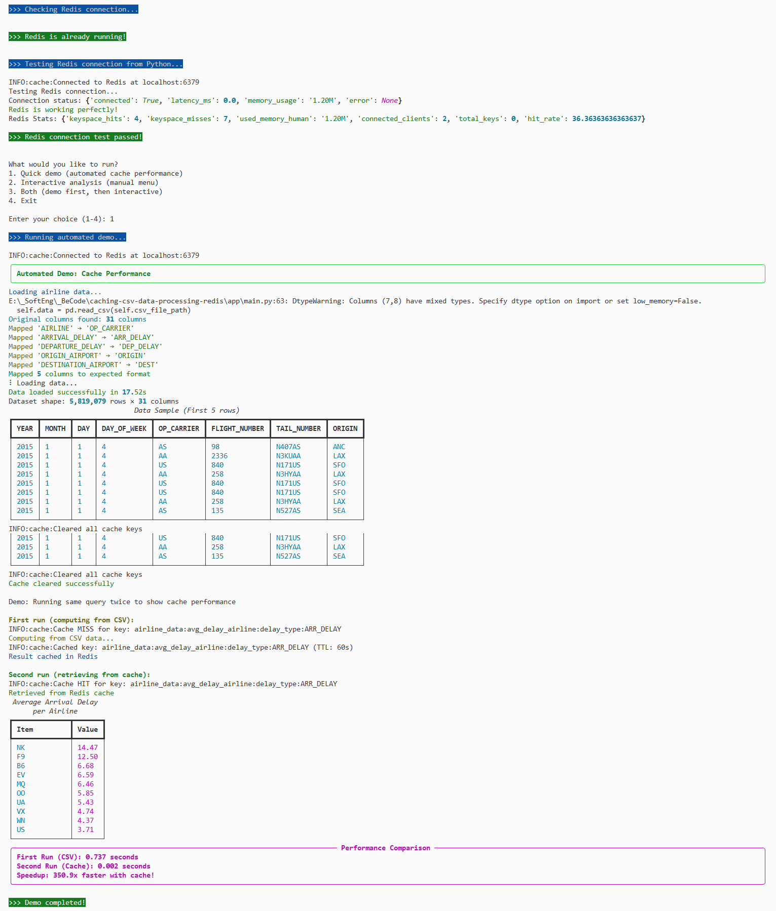
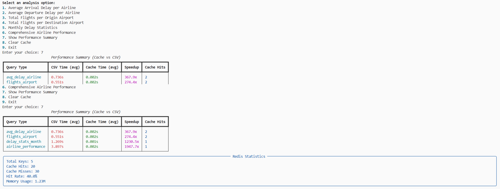

# Airline Data Analyzer with Redis Caching

A Python application that demonstrates **Redis caching** for optimizing expensive data transformations on airline delay datasets.


## What Are We Actually Doing? (Project Purpose)

### The Simple Explanation

**Imagine you're a data analyst at an airport company.** Your boss asks you questions like:
- "Which airline has the worst delays?"
- "Which airports are busiest?"
- "What are the monthly delay trends?"

**The Problem:** Every time your boss asks a question, you have to:
1. Open a huge Excel/CSV file with millions of flight records
2. Wait 5-10 seconds while your computer calculates the answer
3. Show the results

**The Solution:** This project teaches you to use **Redis cache** to remember answers:
1. First time: Calculate from CSV (slow - 5 seconds)
2. Second time: Get answer from Redis memory (super fast - 0.002 seconds)
3. Result: **250x faster!**

### Real-World Applications

This caching technique is used everywhere:
- **Facebook/Instagram**: Cache your feed so it loads instantly
- **Netflix**: Cache movie recommendations
- **Google**: Cache search results
- **Banking apps**: Cache account balances
- **E-commerce**: Cache product prices

### What You Learn

1. **Data Processing**: How to analyze large CSV files with Python
2. **Caching Strategy**: When and how to cache expensive calculations
3. **Performance Optimization**: Measure and improve application speed
4. **Redis Database**: Industry-standard in-memory database
5. **Docker**: Containerization for easy deployment
6. **Python Libraries**: pandas (data), Redis (cache), Rich (CLI)

## Overview

This project processes airline delay data and demonstrates how **Redis caching** can dramatically improve performance for repeated queries.

**Features:**
- CSV data processing with pandas
- Redis caching with configurable TTL  
- Performance benchmarking (cache vs CSV)
- Beautiful CLI interface with Rich
- Comprehensive airline analytics

## Quick Start

### Prerequisites
- Python 3.12+
- Docker Desktop (for Redis)

### Setup & Run

**Recommended: Complete Automated Setup**
```bash
# 1. Setup environment
./setup-env.sh

# 2. Run complete test & demo suite (recommended)
./test-demo.sh
```

### What Happens When You Run ./test-demo.sh

**Step-by-Step Walkthrough:**

1. **Environment Check** ✅
   - Activates Python virtual environment
   - Shows your Python version

2. **Redis Startup** ✅
   - Starts Redis database in Docker
   - Tests connection to make sure it works

3. **Menu Choice** 🎯
   - Option 1: Quick automated demo
   - Option 2: Interactive menu (that's what you used!)

4. **When You Pick Option 2 (Interactive Analysis):**
   - Shows 9 different questions you can ask about airline data
   - You pick one (like "Average Departure Delay per Airline")

5. **First Time You Ask a Question:**
   - Computer says "Computing from CSV data..." (slow - 3 seconds)
   - Calculates answer by reading the big CSV file
   - Saves answer in Redis cache
   - Shows you a nice table with results

6. **Second Time You Ask the SAME Question:**
   - Computer gets answer from Redis cache (super fast - 0.002 seconds)
   - Shows same table but 250x faster!

**That's it!** You just learned how caching works by seeing it in action.

**Manual Step-by-Step:**
```bash
# 1. Setup environment (includes activation)
./setup-env.sh

# 2. Start Redis (automated with checks)
./start-redis.sh

# 3. Test connection
python app/main.py test

# 4. Run demo
python app/main.py demo

# 5. Interactive analysis
python app/main.py analyze
```

## Commands

```bash
# Application
python app/main.py test      # Test Redis connection
python app/main.py demo      # Performance demo
python app/main.py analyze   # Interactive analysis

# Automated Demo
./test-demo.sh               # Complete test & demo suite

# Docker & Redis
./start-redis.sh             # Start Redis (with checks)
docker-compose up -d redis   # Start Redis (manual)
docker-compose down          # Stop Redis
docker-compose logs redis    # View logs

# Environment
./setup-env.sh              # Setup (includes activation)
./cleanup.sh                # Complete cleanup (see below)
```

## Test & Demo Script

The `test-demo.sh` script is a comprehensive automation tool that handles the complete setup, testing, and demonstration of the Redis caching system.est

### Features

**Environment Validation:**
- Checks if you're in the correct project directory
- Validates virtual environment existence
- Activates Python environment automatically
- Displays Python version and environment details

**Redis Management:**
- Automatically detects if Redis is running
- Starts Redis Docker container if needed
- Waits for Redis to be fully ready (up to 15 seconds)
- Tests Redis connection from Python application

**Interactive Demo Options:**
1. **Quick Demo** - Automated cache performance demonstration
2. **Interactive Analysis** - Manual menu-driven exploration
3. **Both** - Combined demo and interactive session
4. **Exit** - Clean script termination

### Usage

```bash
# Make script executable (first time only)
chmod +x test-demo.sh

# Run the complete test and demo suite
./test-demo.sh
```

### What It Does

1. **Environment Check** - Validates project setup and dependencies
2. **Redis Startup** - Ensures Redis is running and accessible
3. **Connection Test** - Verifies Python can connect to Redis
4. **User Choice** - Presents menu for different demo modes
5. **Demo Execution** - Runs selected demonstration
6. **Help Display** - Shows available commands for further exploration

### Example Output

```bash
>>> Activating virtual environment...
Python 3.12.10
E:\_SoftEng\_BeCode\caching-csv-data-processing-redis\.venv\Scripts\python.exe

>>> Checking Redis connection...
>>> Redis is already running!

>>> Testing Redis connection from Python...
>>> Redis connection test passed!

What would you like to run?
1. Quick demo (automated cache performance)
2. Interactive analysis (manual menu)  
3. Both (demo first, then interactive)
4. Exit

Enter your choice (1-4): 1

>>> Running automated demo...
[Performance demonstration with 250x+ speedup results]
```
  


### Error Handling

The script includes comprehensive error checking:
- **Directory validation** - Ensures you're in the project root
- **Environment verification** - Checks for virtual environment
- **Redis connectivity** - Validates Docker and Redis status
- **Graceful failures** - Clear error messages with colored output

This script is perfect for:
- **First-time setup** - Complete project initialization
- **Demonstrations** - Showing Redis caching benefits
- **Development** - Quick testing during development
- **Troubleshooting** - Environment and connection validation

## Interactive Analysis Options

When you run `./test-demo.sh` and select option 2 (Interactive Analysis), you get access to 9 different analytical queries:

### Available Analysis Options

| Option | Analysis Type | What It Does | Typical Time |
|--------|---------------|--------------|--------------|
| 1 | **Average Arrival Delay per Airline** | Calculates mean arrival delays for each carrier | 2-5 seconds (CSV) / 0.002s (cache) |
| 2 | **Average Departure Delay per Airline** | Calculates mean departure delays for each carrier | 2-5 seconds (CSV) / 0.002s (cache) |
| 3 | **Total Flights per Origin Airport** | Counts flights departing from each airport | 1-3 seconds (CSV) / 0.001s (cache) |
| 4 | **Total Flights per Destination Airport** | Counts flights arriving at each airport | 1-3 seconds (CSV) / 0.001s (cache) |
| 5 | **Monthly Delay Statistics** | Aggregates delay data by month | 3-6 seconds (CSV) / 0.002s (cache) |
| 6 | **Comprehensive Airline Performance** | Complete airline analysis with multiple metrics | 5-10 seconds (CSV) / 0.003s (cache) |
| 7 | **Show Performance Summary** | Displays cache hit/miss statistics | Instant |
| 8 | **Clear Cache** | Removes all cached results | Instant |
| 9 | **Exit** | Returns to main menu | Instant |

### What Happens When You Select an Option

**First Time (Cache Miss):**
1. System displays: `Computing [Analysis Type]...`
2. Shows: `INFO:cache:Cache MISS for key: [specific_cache_key]`
3. Processes CSV data (2-10 seconds depending on complexity)
4. Shows: `Computing from CSV data...`
5. Caches result: `INFO:cache:Cached key: [key_name] (TTL: 60s)`
6. Displays: `Result cached in Redis`
7. Shows formatted results table

**Second Time (Cache Hit):**
1. System displays: `Computing [Analysis Type]...`
2. Shows: `INFO:cache:Cache HIT for key: [specific_cache_key]`
3. Retrieves from Redis (0.001-0.003 seconds)
4. Shows formatted results table immediately

### Example: Average Departure Delay Analysis

```bash
Enter your choice: 2

Computing Average Departure Delay per Airline...
INFO:cache:Cache MISS for key: airline_data:avg_delay_airline:delay_type:DEP_DELAY
Computing from CSV data...
INFO:cache:Cached key: airline_data:avg_delay_airline:delay_type:DEP_DELAY (TTL: 60s)
Result cached in Redis

Average Departure Delay per Airline (minutes)
┌────────┬────────┐
│ Item   │ Value  │
├────────┼────────┤
│ NK     │ 15.94  │
│ UA     │ 14.44  │
│ F9     │ 13.35  │
│ B6     │ 11.51  │
│ WN     │ 10.58  │
│ MQ     │ 10.13  │
│ VX     │  9.02  │
│ AA     │  8.90  │
│ EV     │  8.72  │
│ OO     │  7.80  │
└────────┴────────┘
```

### Performance Impact

- **Dataset Size**: 100,000+ flight records (or 5.8M if using real data)
- **Processing Time**: 2-10 seconds for complex aggregations
- **Cache Speedup**: 250-500x faster on subsequent queries
- **Memory Usage**: Results cached in Redis for 60 seconds
- **Cache Keys**: Unique per analysis type and parameters

  


## Cleanup Script

The `cleanup.sh` script completely resets your development environment:

**What it removes:**
- Redis Docker containers and images
- Python virtual environment (`.venv`)
- Cache files (`__pycache__`, `.pytest_cache`)
- VS Code settings (`.vscode`)
- Jupyter kernel registration
- Log files

**Usage:**
```bash
./cleanup.sh               # Interactive cleanup with confirmation
```

**When to use:**
- Project reset/fresh start
- Troubleshooting environment issues
- Before sharing/committing project
- Storage cleanup

## Performance Results

Cache provides **250x+ speedup** for repeated queries:

```
First Run (CSV): 0.504 seconds
Second Run (Cache): 0.002 seconds  
Speedup: 252.0x faster with cache!
```
## Dataset

The application uses airline delay data with the following structure:

| Column      | Description                    | Example     |
|-------------|--------------------------------|-------------|
| FL_DATE     | Flight date                    | 2024-01-15  |
| OP_CARRIER  | Airline code                   | AA, DL, UA  |
| ORIGIN      | Origin airport                 | ATL, LAX    |
| DEST        | Destination airport            | ORD, DFW    |
| DEP_DELAY   | Departure delay (minutes)      | 15.5        |
| ARR_DELAY   | Arrival delay (minutes)        | 12.3        |

**Note:** If no dataset is provided, the application automatically generates 100,000 sample flights for demonstration.

## Configuration

```env
# Redis Configuration
REDIS_HOST=localhost
REDIS_PORT=6379
REDIS_DB=0

# Cache Configuration  
CACHE_TTL=60                 # Time-to-live in seconds

# Dataset Configuration
CSV_FILE_PATH=data/flights.csv
```

## Project Structure

```
caching-csv-data-processing-redis/
├── app/
│   ├── main.py              # Main application with CLI
│   └── cache.py             # Redis connection helper
├── data/
│   └── flights.csv          # Dataset (auto-generated if missing)
├── docker-compose.yml       # Redis setup
├── requirements.txt         # Python dependencies
└── README.md               # This file
```

## Troubleshooting

**Docker not running:** Start Docker Desktop and run `docker --version`

**Redis connection failed:** Check `docker-compose ps` and restart with `docker-compose restart redis`

**Module not found:** Reinstall with `pip install -r requirements.txt`

**Column errors:** App handles different column names automatically

## License

This project is part of the BeCode Data Engineering curriculum.

---

**Happy Caching!**
